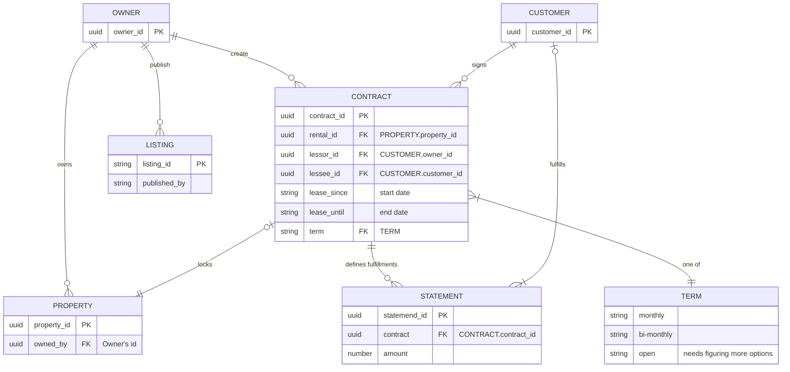
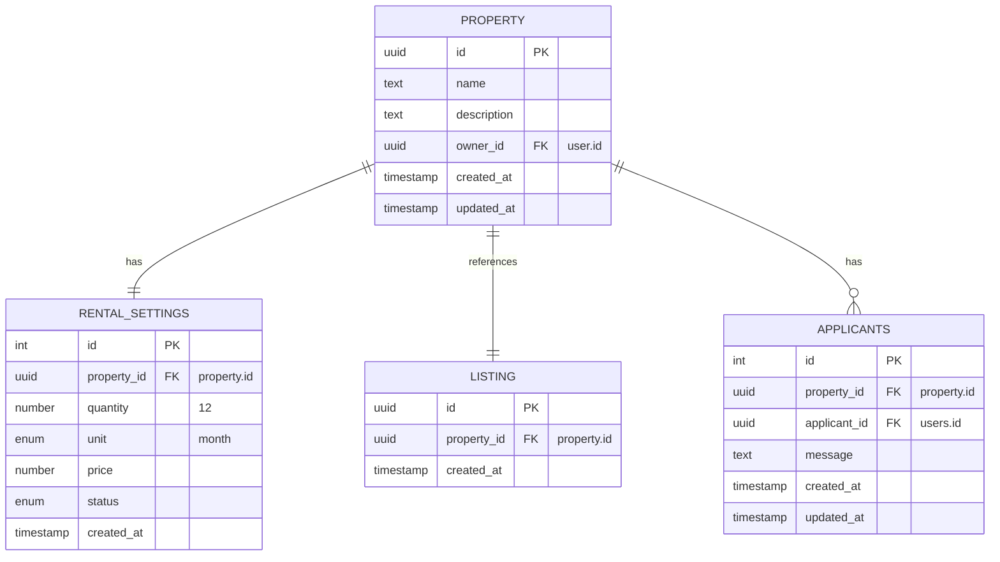
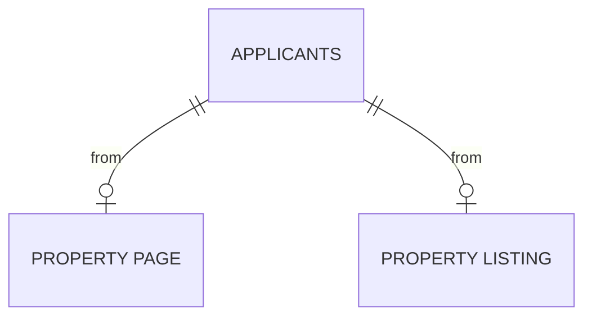

- This document is still in active development

```mermaid
erDiagram
    TERM {
        string monthly
        string bi-monthly
        string open "needs figuring more options"
    }
    OWNER {
        uuid owner_id PK
    }
    CUSTOMER {
        uuid customer_id PK
    }
    CONTRACT {
        uuid contract_id PK
        uuid rental_id FK "PROPERTY.property_id"
        uuid lessor_id FK "CUSTOMER.owner_id"
        uuid lessee_id FK "CUSTOMER.customer_id"
        string lease_since "start date"
        string lease_until "end date"
        string term FK "TERM"
    }
    STATEMENT {
        uuid statemend_id PK
        uuid contract FK "CONTRACT.contract_id"
        number amount
    }
    PROPERTY {
        uuid property_id PK
        uuid owned_by FK "Owner's id"
    }
    LISTING {
        string listing_id PK
        string published_by
    }

    OWNER ||--o{ PROPERTY : "owns"
    OWNER ||--o{ LISTING : "publish"
    OWNER ||--o{ CONTRACT : "create"
    CONTRACT |o--|| PROPERTY : "locks"
    CONTRACT ||--o{ STATEMENT : "defines fulfillments"
    CONTRACT }|--|| TERM : "one of"
    CUSTOMER ||--o{ CONTRACT : "signs"
    CUSTOMER |o--|{ STATEMENT : "fulfills"
```

---

### Property with Rental Settings

- currently a property will only have 1 rental setup

```mermaid
erDiagram

PROPERTY {
    uuid id PK
    text name
    text description
    uuid owner_id FK "user.id"
    timestamp created_at
    timestamp updated_at
}

RENTAL_SETTINGS {
    int id PK
    uuid property_id FK "property.id"
    number quantity "12"
    enum unit "month"
    number price
    enum status
    timestamp created_at
}

APPLICANTS {
    int id PK
    uuid property_id FK "property.id"
    uuid applicant_id FK "users.id"
    text message
    timestamp created_at
    timestamp updated_at
}

LISTING {
    uuid id PK
    uuid property_id FK "property.id"
    timestamp created_at
}

PROPERTY ||--|| RENTAL_SETTINGS : "has"
PROPERTY ||--|| LISTING : "references"
PROPERTY ||--o{ APPLICANTS : "has"
```

```mermaid
erDiagram

APPLICANTS ||--o| "PROPERTY PAGE" : "from"
APPLICANTS ||--o| "PROPERTY LISTING" : "from"
```
