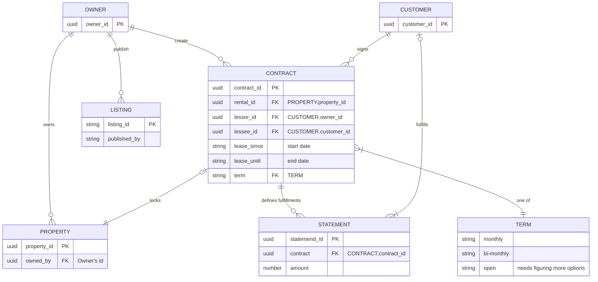

* This document is still in active development

```mermaid
erDiagram
    TERM {
        string monthly
        string bi-monthly
        string open "needs figuring more options"
    }
    OWNER {
        uuid owner_id PK
    }
    CUSTOMER {
        uuid customer_id PK
    }
    CONTRACT {
        uuid contract_id PK
        uuid rental_id FK "PROPERTY.property_id"
        uuid lessor_id FK "CUSTOMER.owner_id"
        uuid lessee_id FK "CUSTOMER.customer_id"
        string lease_since "start date"
        string lease_until "end date"
        string term FK "TERM"
    }
    STATEMENT {
        uuid statemend_id PK
        uuid contract FK "CONTRACT.contract_id"
        number amount
    }
    PROPERTY {
        uuid property_id PK
        uuid owned_by FK "Owner's id"
    }
    LISTING {
        string listing_id PK
        string published_by
    }

    OWNER ||--o{ PROPERTY : "owns"
    OWNER ||--o{ LISTING : "publish"
    OWNER ||--o{ CONTRACT : "create"
    CONTRACT |o--|| PROPERTY : "locks"
    CONTRACT ||--o{ STATEMENT : "defines fulfillments"
    CONTRACT }|--|| TERM : "one of"
    CUSTOMER ||--o{ CONTRACT : "signs"
    CUSTOMER |o--|{ STATEMENT : "fulfills"
```
