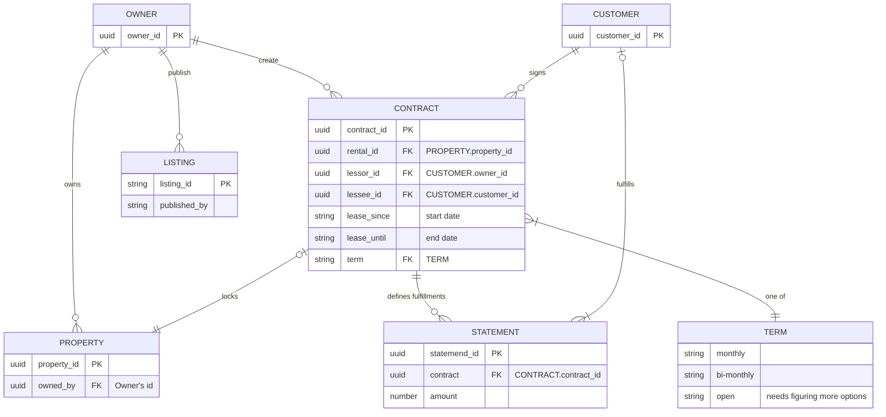
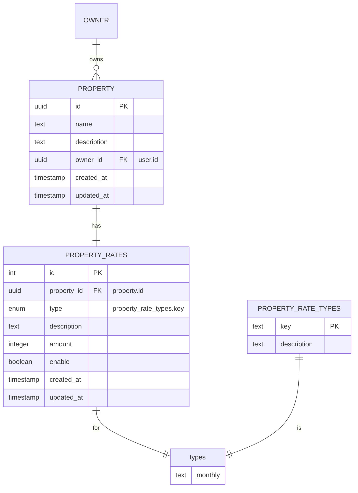
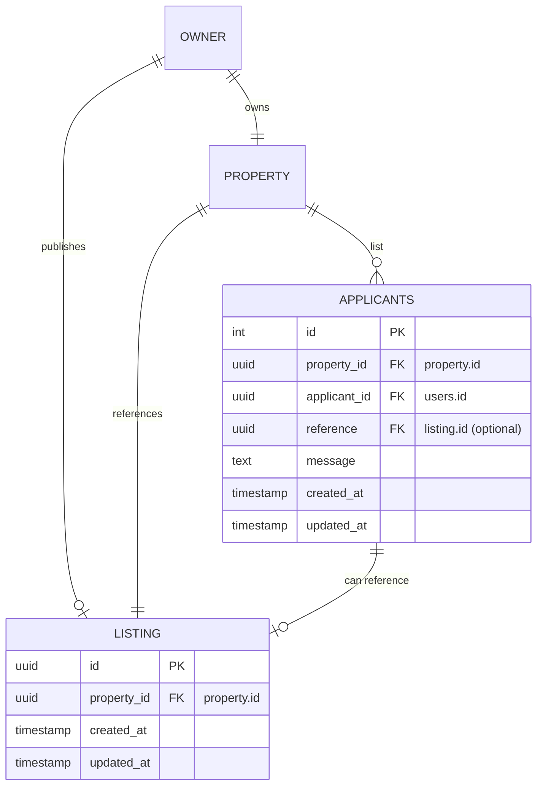
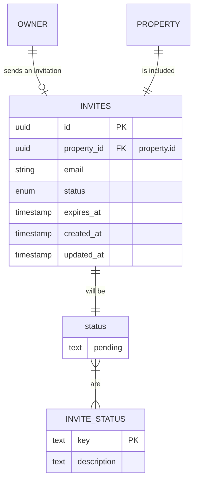

- This document is still in active development

```mermaid
erDiagram
    TERM {
        string monthly
        string bi-monthly
        string open "needs figuring more options"
    }
    OWNER {
        uuid owner_id PK
    }
    CUSTOMER {
        uuid customer_id PK
    }
    CONTRACT {
        uuid contract_id PK
        uuid rental_id FK "PROPERTY.property_id"
        uuid lessor_id FK "CUSTOMER.owner_id"
        uuid lessee_id FK "CUSTOMER.customer_id"
        string lease_since "start date"
        string lease_until "end date"
        string term FK "TERM"
    }
    STATEMENT {
        uuid statemend_id PK
        uuid contract FK "CONTRACT.contract_id"
        number amount
    }
    PROPERTY {
        uuid property_id PK
        uuid owned_by FK "Owner's id"
    }
    LISTING {
        string listing_id PK
        string published_by
    }

    OWNER ||--o{ PROPERTY : "owns"
    OWNER ||--o{ LISTING : "publish"
    OWNER ||--o{ CONTRACT : "create"
    CONTRACT |o--|| PROPERTY : "locks"
    CONTRACT ||--o{ STATEMENT : "defines fulfillments"
    CONTRACT }|--|| TERM : "one of"
    CUSTOMER ||--o{ CONTRACT : "signs"
    CUSTOMER |o--|{ STATEMENT : "fulfills"
```

---

### Property & Rental Rates

```mermaid
erDiagram

PROPERTY {
    uuid id PK
    text name
    text description
    uuid owner_id FK "user.id"
    timestamp created_at
    timestamp updated_at
}

PROPERTY_RATES {
    int id PK
    uuid property_id FK "property.id"
    enum type  "property_rate_types.key"
    text description
    integer amount
    boolean enable
    timestamp created_at
    timestamp updated_at
}

PROPERTY_RATE_TYPES {
    text key PK
    text description
}

types {
    text monthly
}

OWNER ||--o{ PROPERTY : owns
PROPERTY ||--|| PROPERTY_RATES : "has"
PROPERTY_RATES ||--|| types : "for"
PROPERTY_RATE_TYPES ||--|| types : "is"
```

### Property & Applicants

```mermaid
erDiagram

APPLICANTS {
    int id PK
    uuid property_id FK "property.id"
    uuid applicant_id FK "users.id"
    uuid reference FK "listing.id (optional)"
    text message
    timestamp created_at
    timestamp updated_at
}

LISTING {
    uuid id PK
    uuid property_id FK "property.id"
    timestamp created_at
    timestamp updated_at
}

OWNER ||--o| LISTING : "publishes"
OWNER ||--|| PROPERTY: "owns"
PROPERTY ||--|| LISTING : "references"
PROPERTY ||--o{ APPLICANTS : "list"
APPLICANTS ||--o| LISTING : "can reference"
```

<!--
### Tenant Invite

```mermaid
erDiagram

INVITES {
    uuid id PK
    uuid property_id FK "property.id"
    string email
    enum status
    timestamp expires_at
    timestamp created_at
    timestamp updated_at
}

INVITE_STATUS {
    text key PK
    text description
}

status {
    text pending
}


OWNER ||--o| INVITES: "sends an invitation"
PROPERTY ||--|| INVITES : "is included"
INVITES ||--|| status : "will be"
status }|--|{ INVITE_STATUS : "are"
```
-->
