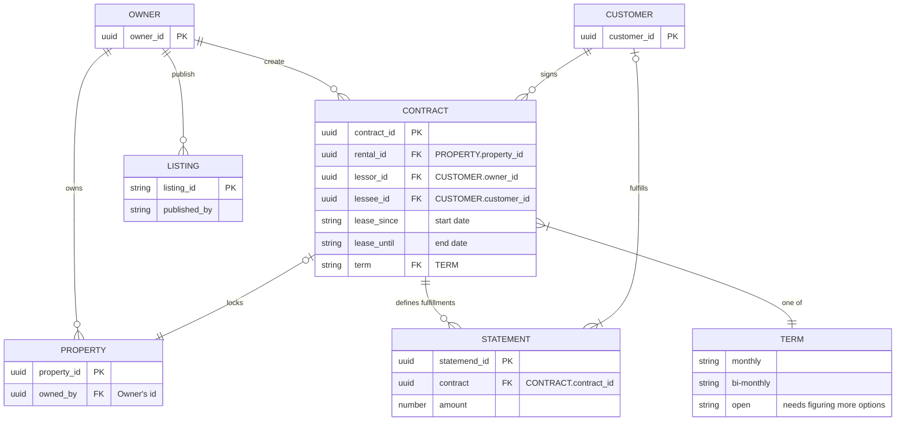
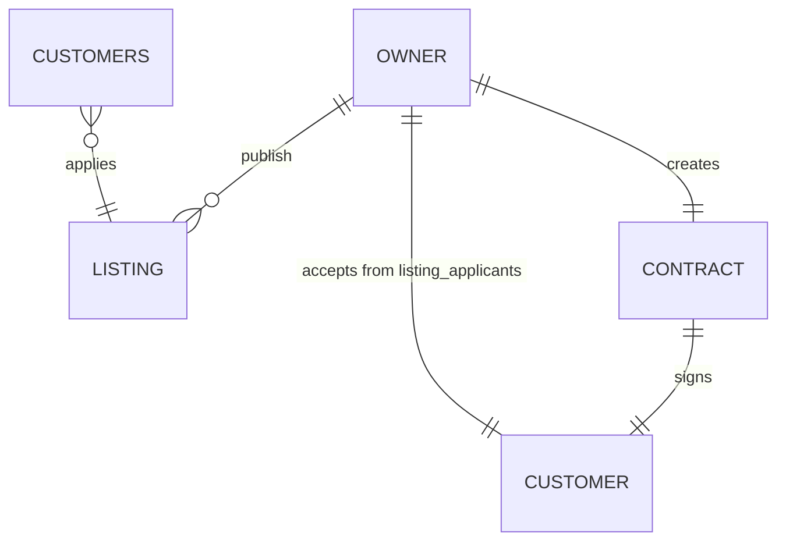
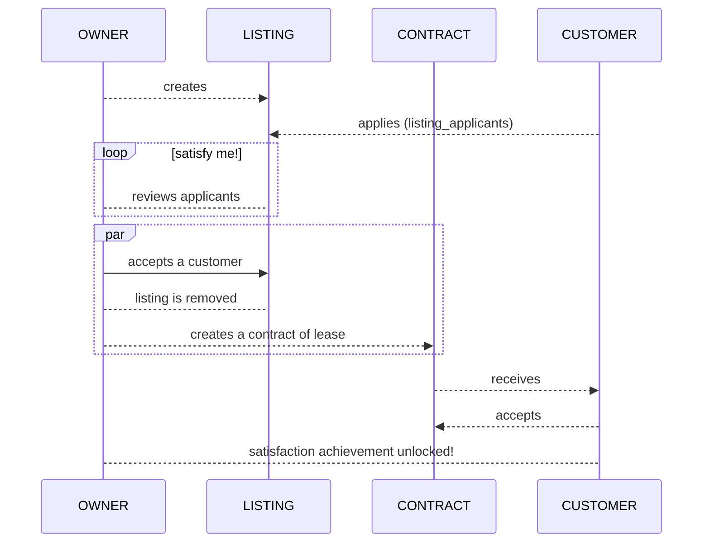

- This document is still in active development

```mermaid
erDiagram
    TERM {
        string monthly
        string bi-monthly
        string open "needs figuring more options"
    }
    OWNER {
        uuid owner_id PK
    }
    CUSTOMER {
        uuid customer_id PK
    }
    CONTRACT {
        uuid contract_id PK
        uuid rental_id FK "PROPERTY.property_id"
        uuid lessor_id FK "CUSTOMER.owner_id"
        uuid lessee_id FK "CUSTOMER.customer_id"
        string lease_since "start date"
        string lease_until "end date"
        string term FK "TERM"
    }
    STATEMENT {
        uuid statemend_id PK
        uuid contract FK "CONTRACT.contract_id"
        number amount
    }
    PROPERTY {
        uuid property_id PK
        uuid owned_by FK "Owner's id"
    }
    LISTING {
        string listing_id PK
        string published_by
    }

    OWNER ||--o{ PROPERTY : "owns"
    OWNER ||--o{ LISTING : "publish"
    OWNER ||--o{ CONTRACT : "create"
    CONTRACT |o--|| PROPERTY : "locks"
    CONTRACT ||--o{ STATEMENT : "defines fulfillments"
    CONTRACT }|--|| TERM : "one of"
    CUSTOMER ||--o{ CONTRACT : "signs"
    CUSTOMER |o--|{ STATEMENT : "fulfills"
```

OWNER - LISTING - CONTRACT

```mermaid
erDiagram
    OWNER ||--o{ LISTING : "publish"
    CUSTOMERS }o--|| LISTING: "applies"
    OWNER ||--|| CUSTOMER : "accepts from listing_applicants"
    OWNER ||--|| CONTRACT :"creates"
    CONTRACT ||--|| CUSTOMER: "signs"
```

SEQUENCE OF SATISFATION

```mermaid
sequenceDiagram
    participant OWNER
    participant LISTING
    participant CONTRACT
    participant CUSTOMER

    OWNER-->>LISTING: creates
    CUSTOMER-->>LISTING: applies (listing_applicants)

    loop satisfy me!
        OWNER-->LISTING: reviews applicants
    end

    par
        OWNER->>LISTING: accepts a customer
        OWNER-->LISTING: listing is removed
        OWNER-->>CONTRACT: creates a contract of lease
    end

    CONTRACT-->>CUSTOMER: receives
    CUSTOMER-->>CONTRACT: accepts
    OWNER-->CUSTOMER: satisfaction achievement unlocked!
```
