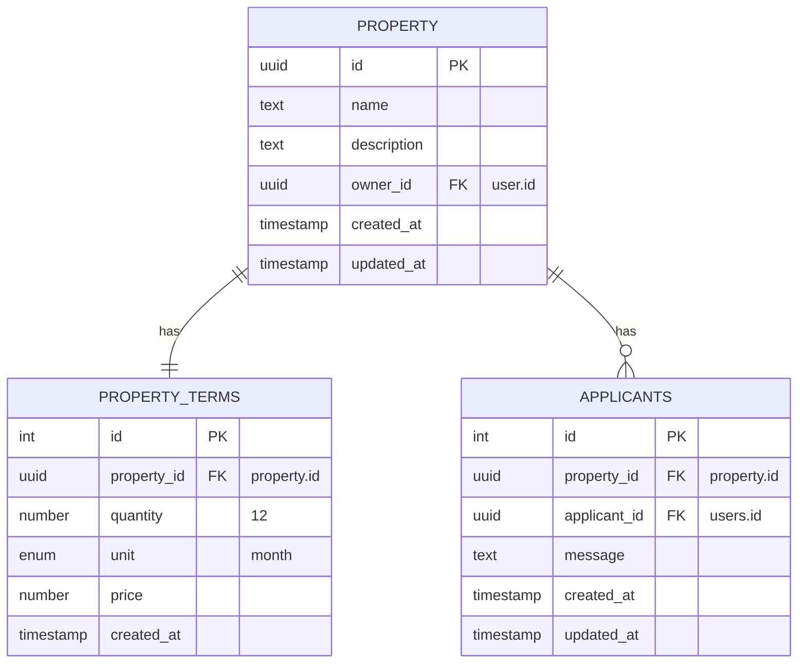
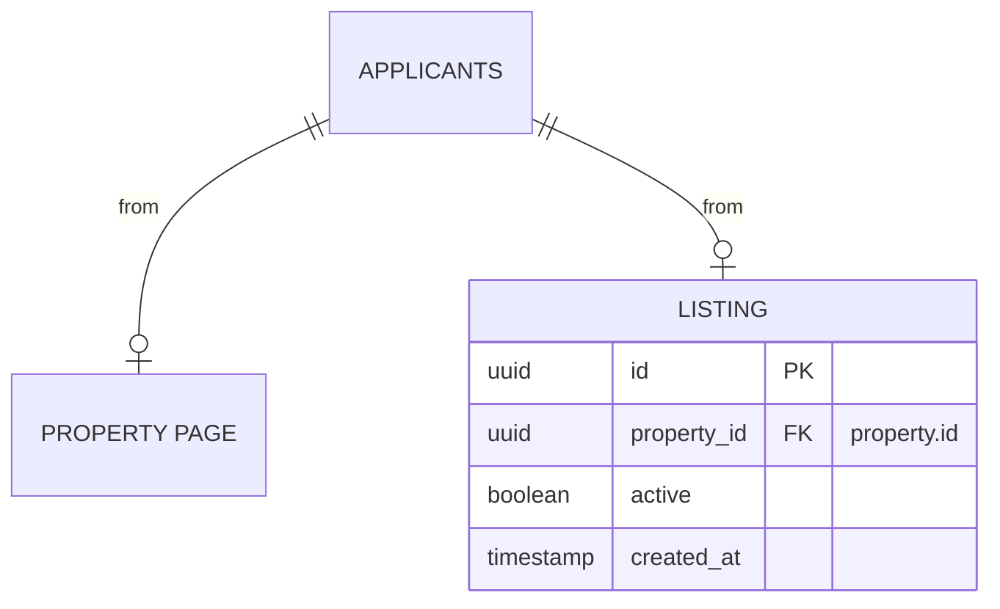

- This document is still in active development

---

### Property

- a property page is visible to the public
- users can apply to a property page directly
- currently a property will only have 1 rental setup
- property availability will be determined by an active TENANT

