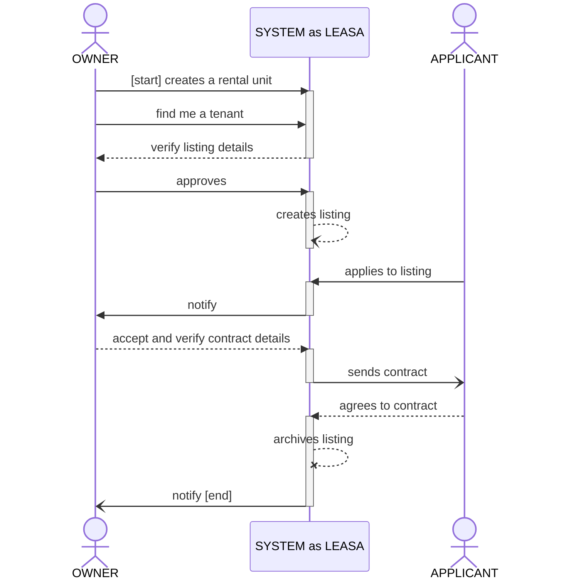

- This document is still in active development

Owner and Applicant Contract Agreement Sequence

```mermaid
sequenceDiagram
    actor O as OWNER
    participant S as SYSTEM as LEASA
    actor A as APPLICANT

    O->>S: [start] creates a rental unit
    activate S
    O->>S: find me a tenant
    S-->>O: verify listing details
    deactivate S
    O->>S: approves
    activate S
    S--)S: creates listing
    deactivate S

    A->>S: applies to listing
    activate S
    S->>O: notify
    deactivate S
    O-->>S: accept and verify contract details
    activate S
    S-)A: sends contract
    deactivate S
    A-->>S: agrees to contract
    activate S
    S--xS: archives listing
    S-)O: notify [end]
    deactivate S
```
