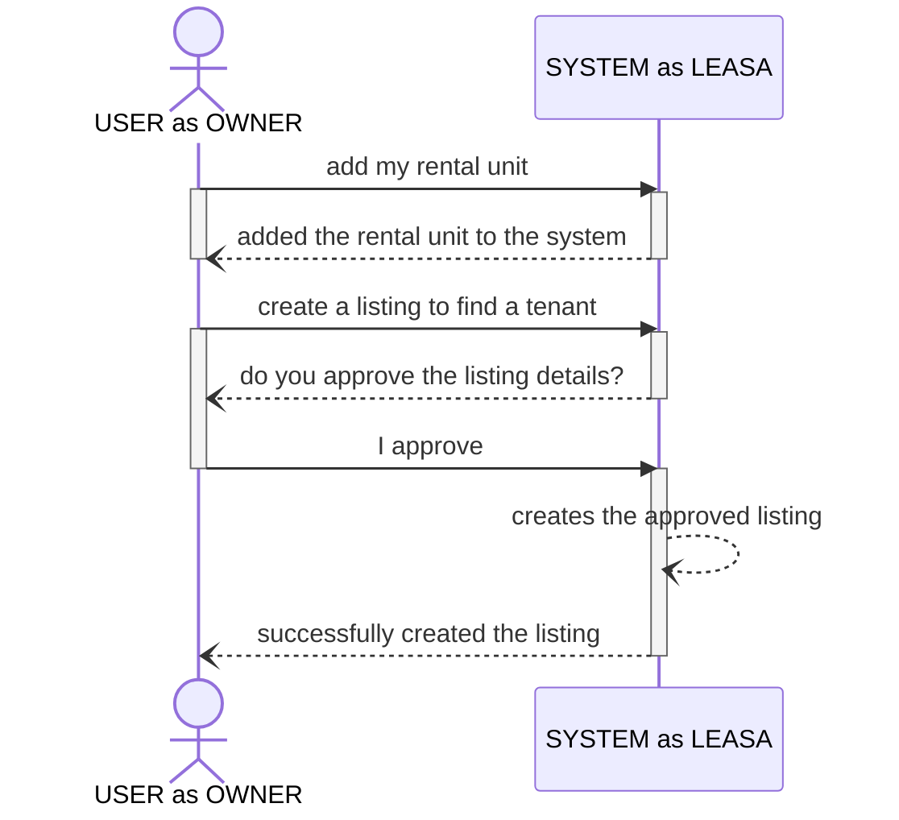
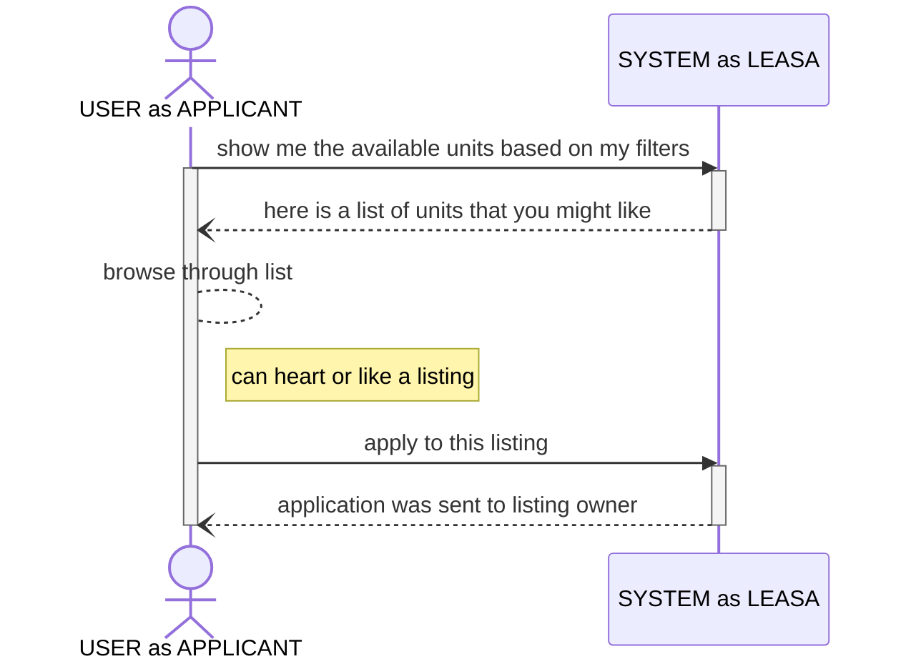

- This document is still in active development

a User as an Owner can add a retal unit and creates a listing to find a tenant.

a User as a Potential Tenant or Applicant is looking to lease a rental unit.

