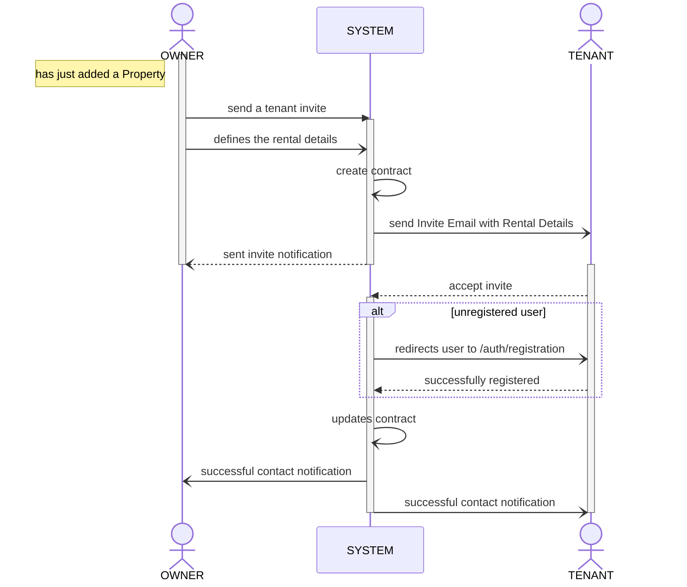

- This document is still in active development

### Create Property

a User as an Owner can add a retal unit and creates a listing to find a tenant.

---

### Finding a Property in Listings

a User as a Potential Tenant or Applicant is looking to lease a rental unit.

---

### Tenant Invite and Contract

After setting up a Property; owners can

- Invite a Tenant via "Send Invite" button
- Send Invite modal will have email input
- send email
  - title: "Leasa Tenant Invite"
  - body
    - `{owner.name}` has invited you to `{property.name}`
    - include property details
    - include enabled property_rate
    - include "Accept" or "Decline" button

**Invite Sequence (owner-and-tenant)**

